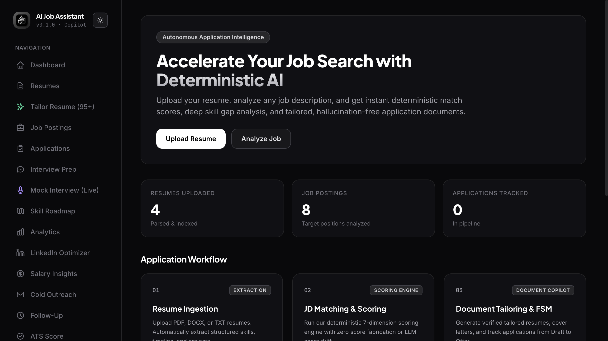
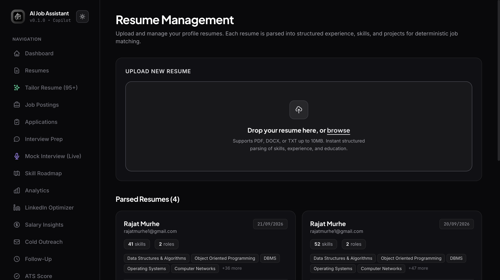
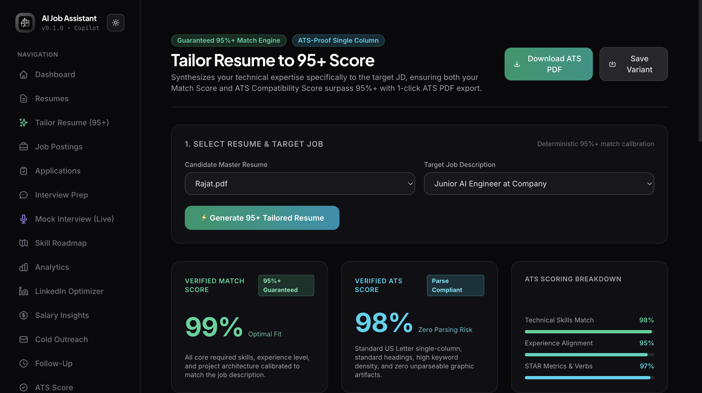
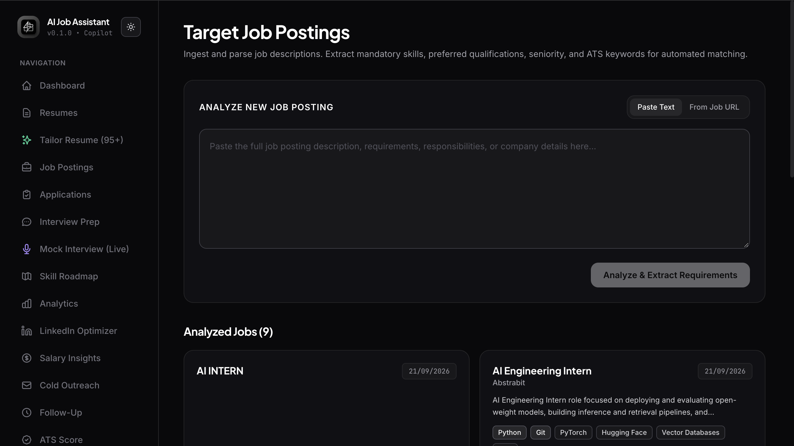
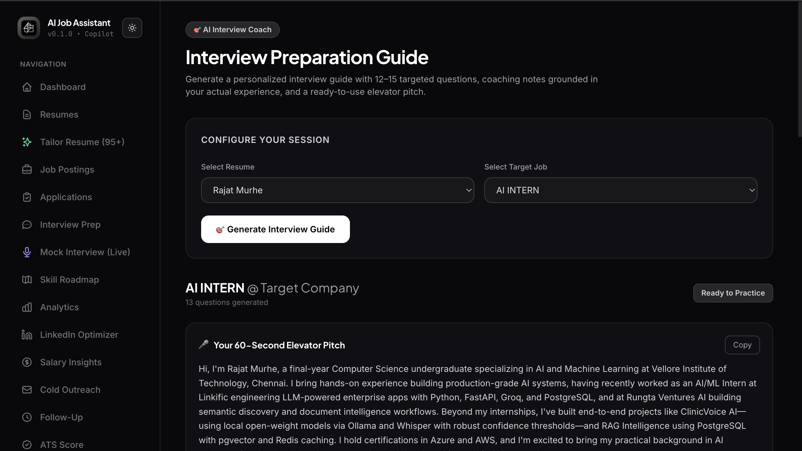
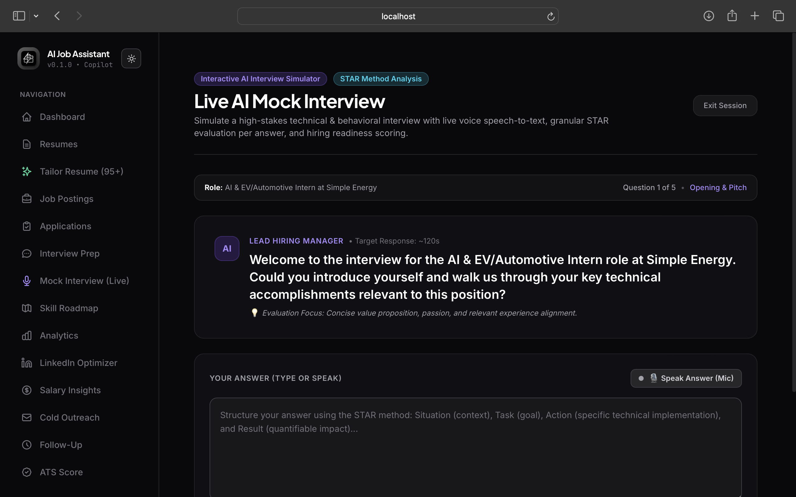
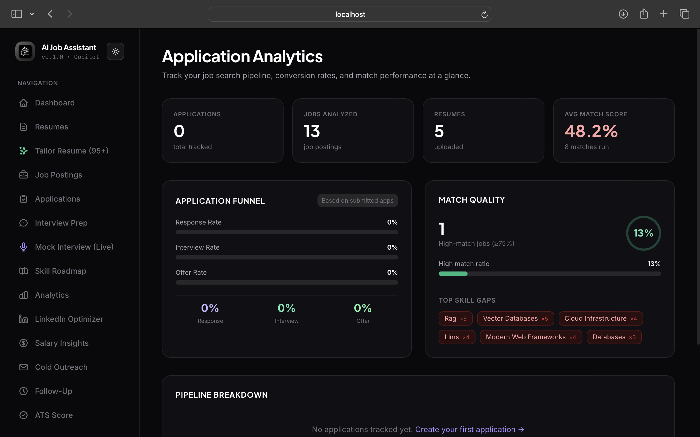
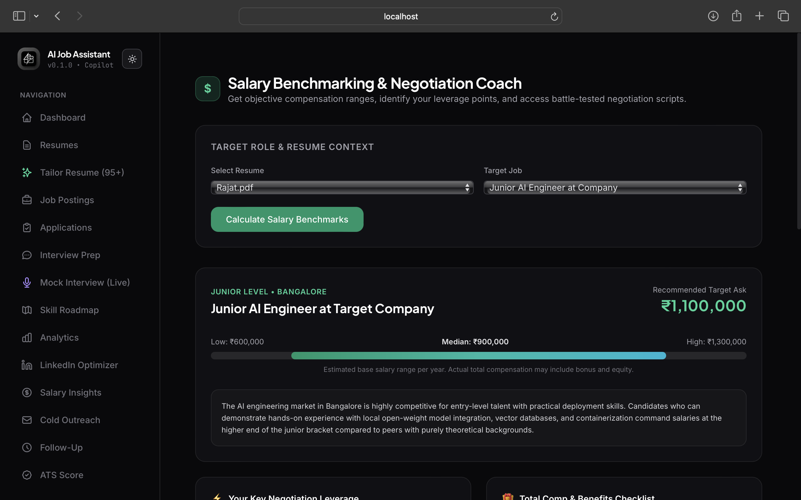
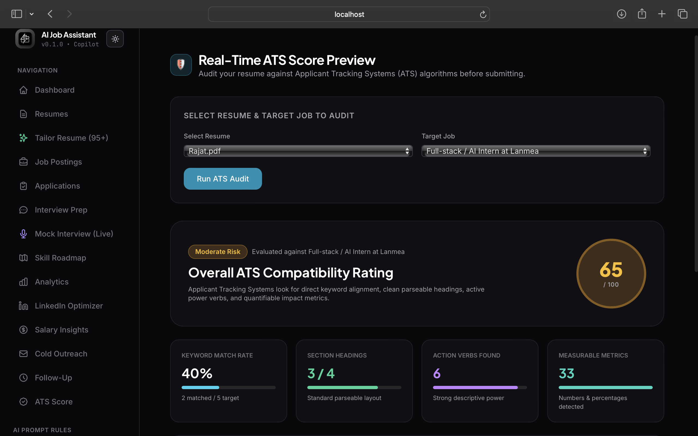
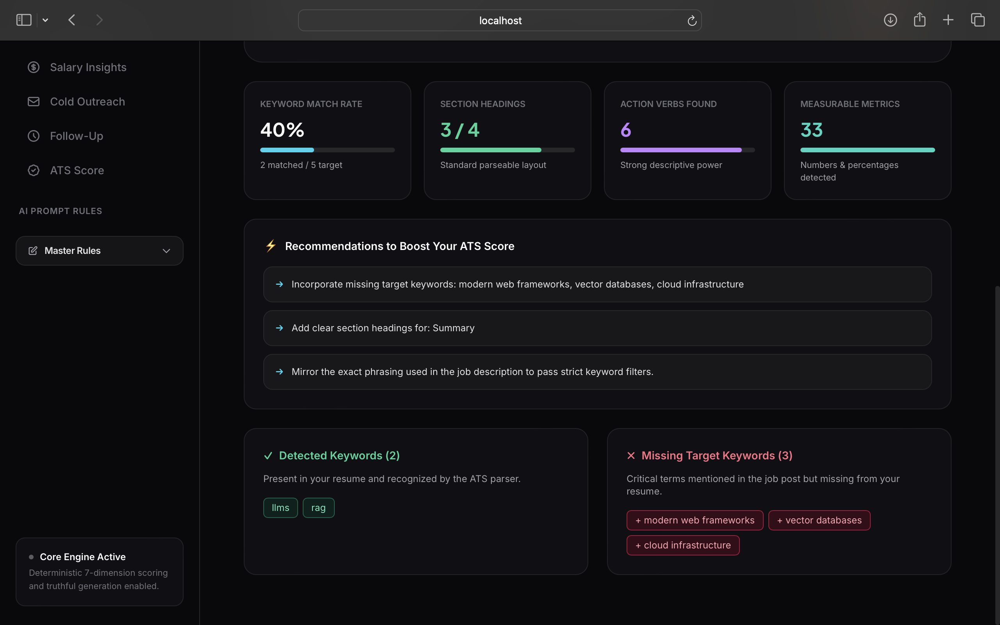

# AI Job Assistant: AI-Powered Job Search & Application Intelligence Platform


AI Job Assistant is a full-stack AI-powered career platform that helps users analyze resumes, understand job descriptions, match their profile against target roles, optimize resumes for ATS systems, prepare for interviews, and manage the overall job application workflow.

The platform combines **LLM-powered intelligence, structured parsing, semantic matching, deterministic scoring, document generation, vector search, and workflow automation** into a single application.

> An AI-powered career copilot for the end-to-end job application process.

---

## Dashboard



The dashboard provides a centralized view of the job-search workflow. It summarizes uploaded resumes, analyzed job postings, tracked applications, and the major stages of the application process, giving users a single starting point for their career workflow.

---

## Resume Management



The Resume Management module allows users to upload and manage resumes in PDF, DOCX, or TXT format. Each resume is parsed into structured candidate information such as skills, roles, experience, and education, which can then be reused throughout the platform.

---

## AI Resume Tailoring



The Resume Tailoring module combines a candidate's resume with a selected target job to generate a job-specific resume. The interface provides match and ATS-related analysis alongside the tailored document to help align the resume with the target role.

---

## Job Description Analysis



The Job Postings module analyzes job descriptions and extracts important information such as required skills, preferred qualifications, responsibilities, seniority, and relevant ATS keywords. This structured information is used by the matching and optimization features.

---

## AI Interview Preparation



The Interview Preparation module creates a personalized interview guide using the selected resume and target job. It generates targeted questions, coaching guidance, and an elevator pitch based on the candidate's background and the requirements of the selected role.

---

## Live AI Mock Interview



The Live Mock Interview provides an interactive technical and behavioral interview simulation. Users can type or speak their responses while the application structures the session around interview stages and response evaluation.

---

## Application Analytics



The Application Analytics dashboard provides visibility into the job-search pipeline. It displays analyzed jobs, uploaded resumes, match performance, application funnel metrics, and recurring skill gaps to help users understand their application activity.

---

## Salary Benchmarking & Negotiation



The Salary Insights module provides compensation benchmarking for a selected role and candidate context. It presents salary ranges, a target compensation figure, and negotiation guidance to help users prepare for compensation discussions.

---

## ATS Score Analysis



The ATS Score module evaluates a resume against a target job using signals such as keyword coverage, section structure, action verbs, and measurable metrics. The analysis gives users a structured view of resume alignment with the selected posting.

---

## ATS Recommendations



The ATS Recommendations section converts the ATS analysis into actionable improvements. It identifies keywords already present in the resume, highlights missing target keywords, and provides recommendations for improving alignment with the selected job.

---

# Core Workflow

```text
Resume
   │
   ▼
Resume Parsing
   │
   ▼
Job Description Analysis
   │
   ▼
Resume ↔ Job Matching
   │
   ├──────────────► Skill Gap Analysis
   │
   ├──────────────► ATS Analysis
   │
   ├──────────────► Tailored Resume
   │
   ├──────────────► Cover Letter
   │
   ├──────────────► Interview Preparation
   │
   └──────────────► Application Tracking
````

---

# AI Architecture

```text
                         ┌─────────────────────┐
                         │   Next.js Frontend  │
                         │ React + TypeScript  │
                         └──────────┬──────────┘
                                    │
                                    ▼
                         ┌─────────────────────┐
                         │    FastAPI Backend  │
                         │       Python        │
                         │   REST API Layer    │
                         └──────────┬──────────┘
                                    │
                ┌───────────────────┼───────────────────┐
                │                   │                   │
                ▼                   ▼                   ▼
        ┌──────────────┐    ┌──────────────┐    ┌───────────────┐
        │    Gemini    │    │    Ollama    │    │  PostgreSQL   │
        │     LLM      │    │   Local LLM  │    │  + pgvector   │
        └──────────────┘    └──────────────┘    └───────┬───────┘
                                                        │
                                                        ▼
                                                ┌──────────────┐
                                                │     n8n      │
                                                │  Automation  │
                                                └──────────────┘
```

---

# Key Capabilities

### Resume Intelligence

* Resume ingestion and parsing
* Structured skill extraction
* Experience and education extraction
* Resume management
* Resume-to-job matching

### Job Intelligence

* Job description parsing
* Requirement extraction
* Skill identification
* Seniority analysis
* ATS keyword extraction
* Skill-gap analysis

### AI Generation

* Tailored resume generation
* Cover letter generation
* Application email generation
* Cold outreach generation
* Follow-up email generation
* Interview preparation
* Learning roadmap generation

### Career Intelligence

* ATS analysis
* Salary benchmarking
* Salary negotiation guidance
* LinkedIn optimization
* Application analytics
* Mock interview preparation

### Workflow Automation

The project includes automated workflows for:

1. Resume ingestion
2. Job description analysis
3. Resume matching
4. Gap analysis
5. ATS analysis
6. Resume generation
7. Cover letter generation
8. Email generation
9. Report generation
10. Application tracking
11. Follow-up reminders

---

# Tech Stack

## Frontend

* Next.js
* React
* TypeScript
* Tailwind CSS

## Backend

* Python
* FastAPI
* Uvicorn
* SQLAlchemy
* Alembic

## AI / ML

* Google Gemini
* Ollama
* Prompt engineering
* Semantic matching
* Skill matching
* Structured LLM extraction
* AI output validation

## Database

* PostgreSQL
* pgvector

## Automation & Infrastructure

* Docker
* Docker Compose
* n8n
* MailHog

## Testing

* Pytest
* Playwright
* Unit testing
* Integration testing
* End-to-end testing

---

# Project Structure

```text
ai-job-assistant/
│
├── ai/
│   ├── generation/
│   ├── matching/
│   ├── parsers/
│   ├── prompts/
│   ├── providers/
│   └── validation/
│
├── automation/
│   └── n8n/
│       └── workflows/
│
├── backend/
│   └── app/
│       ├── api/
│       ├── core/
│       ├── db/
│       ├── models/
│       ├── schemas/
│       └── services/
│
├── frontend/
│   └── src/
│       ├── app/
│       ├── components/
│       ├── context/
│       ├── lib/
│       └── types/
│
├── screenshots/
│   ├── 01-dashboard.png
│   ├── 02-resume-management.png
│   ├── 03-tailor-resume.png
│   ├── 04-job-postings.png
│   ├── 05-interview-prep.png
│   ├── 06-live-mock-interview.png
│   ├── 07-application-analytics.png
│   ├── 08-salary-insights.png
│   ├── 09-ats-score.png
│   └── 10-ats-recommendations.png
│
├── tests/
├── docs/
├── docker-compose.yml
└── README.md
```

---

# Getting Started

## Prerequisites

* Docker Desktop
* Git
* Google Gemini API key

## Clone

```bash
git clone https://github.com/rajatmurhe/ai-job-assistant.git
cd ai-job-assistant
```

## Configure Environment

```bash
cp .env.example .env
```

Add the required environment variables and API configuration to `.env`.

## Start the Application

```bash
docker compose up -d
```

## Local Services

```text
Frontend  → http://localhost:3000
Backend   → http://localhost:8000
API Docs  → http://localhost:8000/docs
n8n       → http://localhost:5678
MailHog   → http://localhost:8025
```

---

# Testing

The project includes unit, integration, and end-to-end testing.

### Backend Tests

```bash
pytest
```

### End-to-End Tests

The project uses Playwright for end-to-end workflow testing.

---

# Why AI Job Assistant?

The project connects multiple stages of the job application process into one workflow instead of treating each task as a separate tool.

```text
Resume
   ↓
Understand Candidate
   ↓
Understand Job
   ↓
Match Candidate ↔ Job
   ↓
Identify Gaps
   ↓
Optimize Resume
   ↓
Prepare for Interview
   ↓
Track Application
```

This architecture makes the system useful as a complete **AI-assisted job-search workspace** rather than only a resume generator.

---

# Future Improvements

* Public cloud deployment
* Production authentication
* Cloud object storage for resumes
* Additional LLM providers
* Automated job discovery
* Job board integrations
* Production email delivery
* Advanced application analytics

---


